# Notes regarding the paper "Weight Normalization: A Simple Reparameterization to Accelerate Training of Deep Neural Networks"

## 1 Introduction

## 2 Weight Normalization

Equation 1:

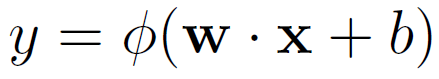

Equation 2:

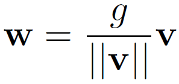

### 2.1 Gradients

Equation 3, left side:

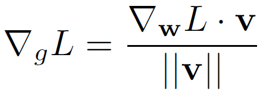

Equation 3, right side:

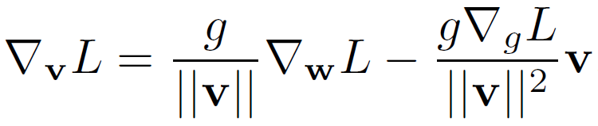

Equation 4, left side:

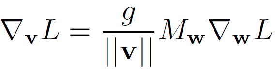

Equation 4, right side:

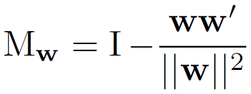

### 2.2 Relation to batch normalization

Unlisted equation regarding batch normalization:

## 3 Data-Dependent Initialization of Parameters

Equation 5, left side:

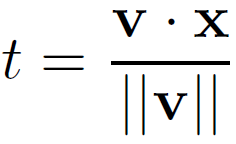

Equation 5, right side:

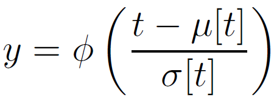

Equation 6, left side:

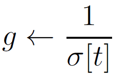

Equation 5, right side:

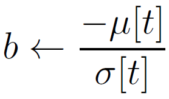

## 4 Mean-only Batch Normalization

Equation 7, left side:

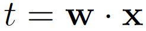

Equation 7, middle:

Equation 7, right side:

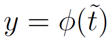

Equation 8:

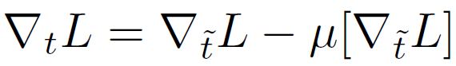

## 5 Experiments

### 5.1 Supervised Classification: CIFAR-10

Figure 1:

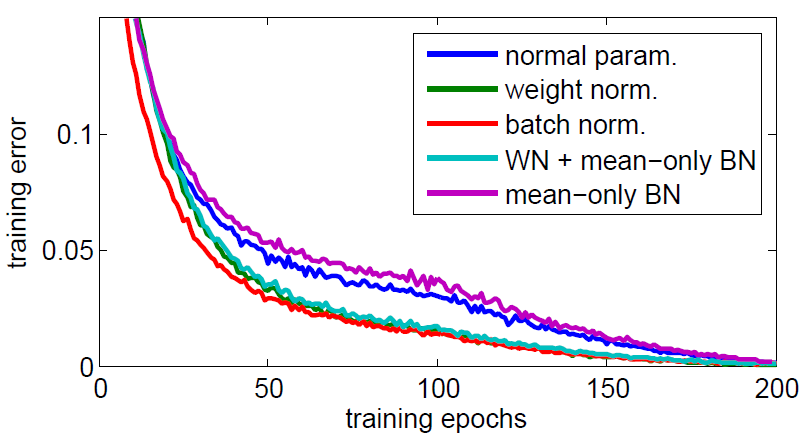

Figure 2:

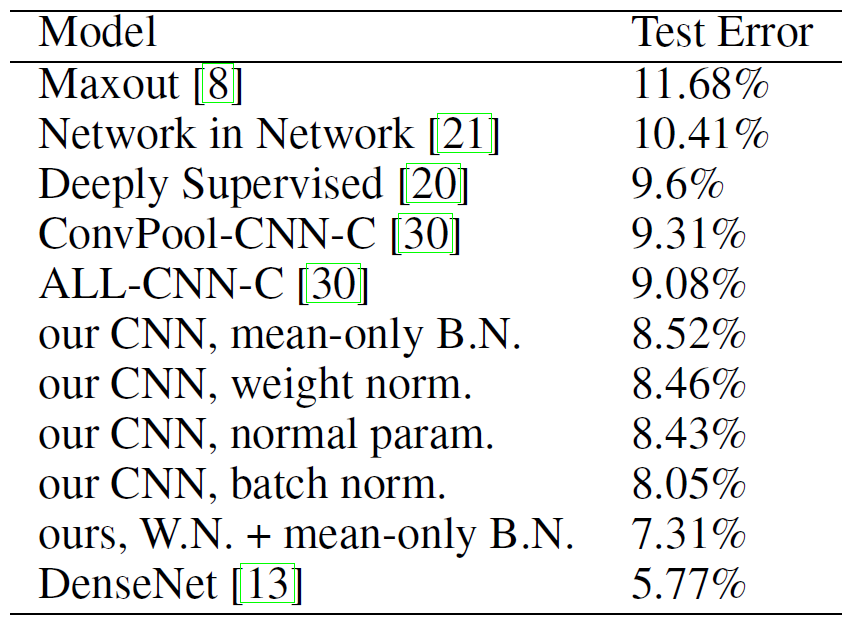

### 5.2 Generative Modelling: Convolutional VAE

Figure 3, left side:

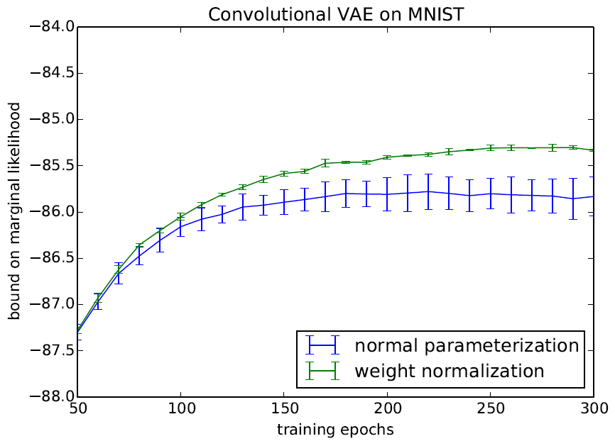

Figure 3, right side: 

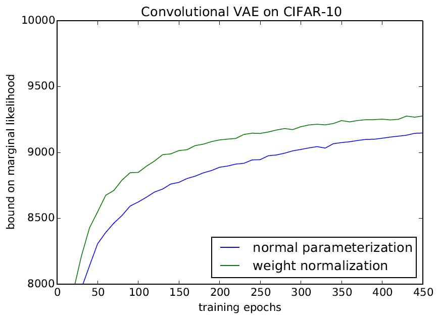

### 5.3 Generative Modelling: DRAW

Figure 4: 

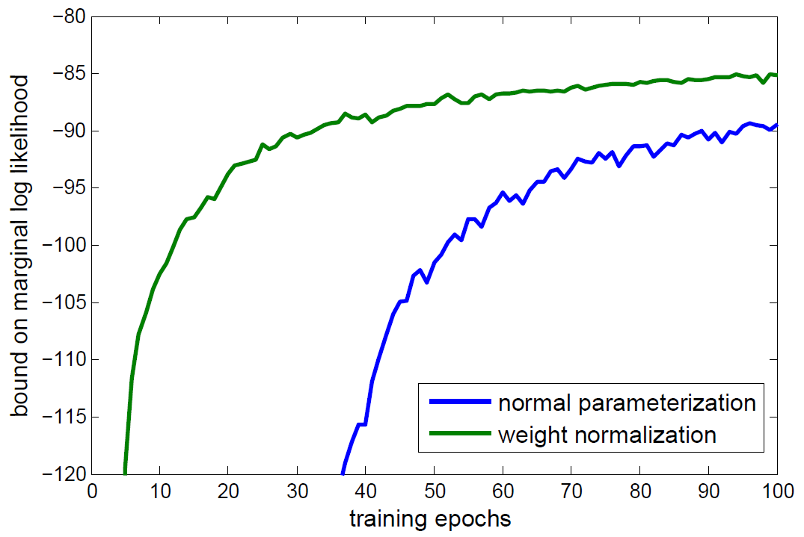

### 5.4 Reinforcement Learning: DQN

Figure 5: 

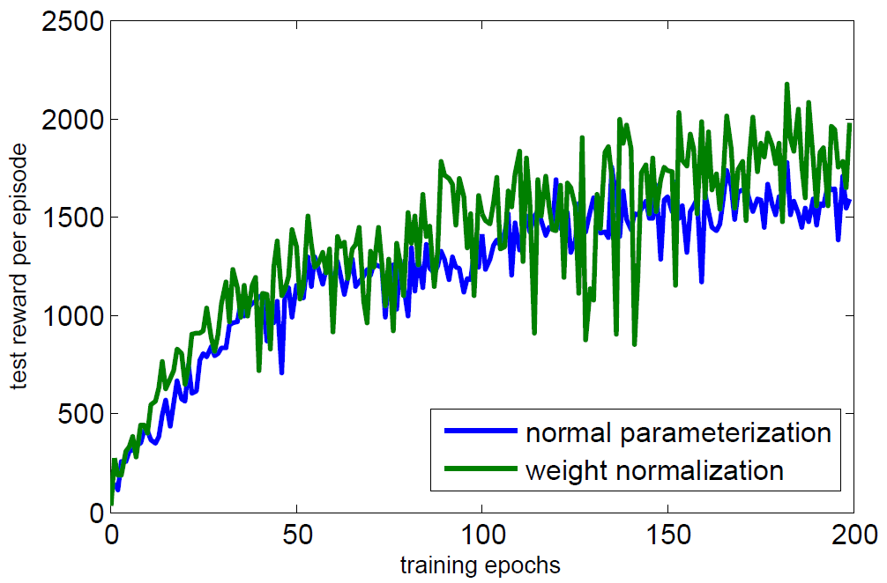

Figure 6: 

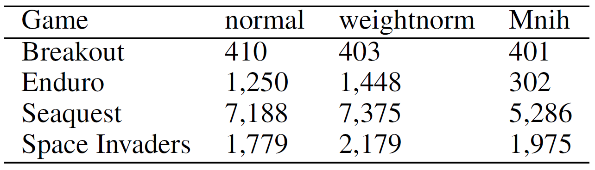

## 6 Conclusion

