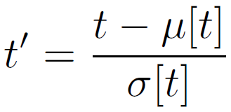

# Notes regarding the paper "Weight Normalization: A Simple Reparameterization to Accelerate Training of Deep Neural Networks"

## 1 Introduction

## 2 Weight Normalization

Equation 1:

Equation 2:

### 2.1 Gradients

Equation 3, left side:

Equation 3, right side:

Equation 4, left side:

Equation 4, right side:

### 2.2 Relation to batch normalization

Unlisted equation regarding batch normalization:

## 3 Data-Dependent Initialization of Parameters

Equation 5, left side:

Equation 5, right side:

Equation 6, left side:

Equation 5, right side:

## 4 Mean-only Batch Normalization

## 5 Experiments

### 5.1 Supervised Classification: CIFAR-10

### 5.2 Generative Modelling: Convolutional VAE

### 5.3 Generative Modelling: DRAW

### 5.4 Reinforcement Learning: DQN

## 6 Conclusion

